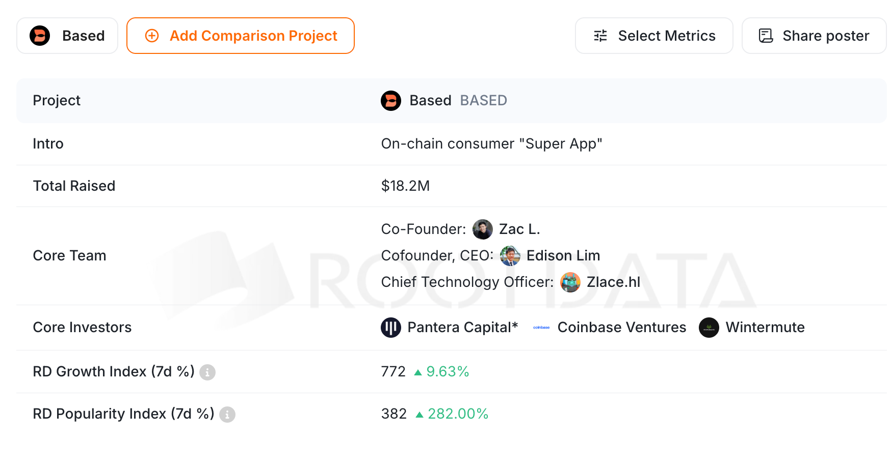
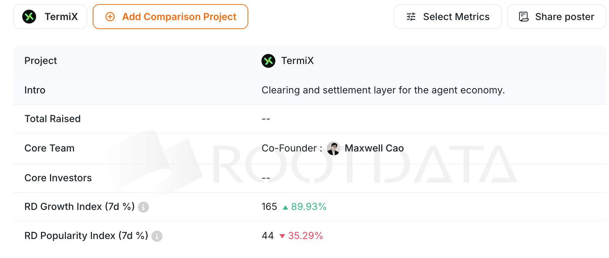
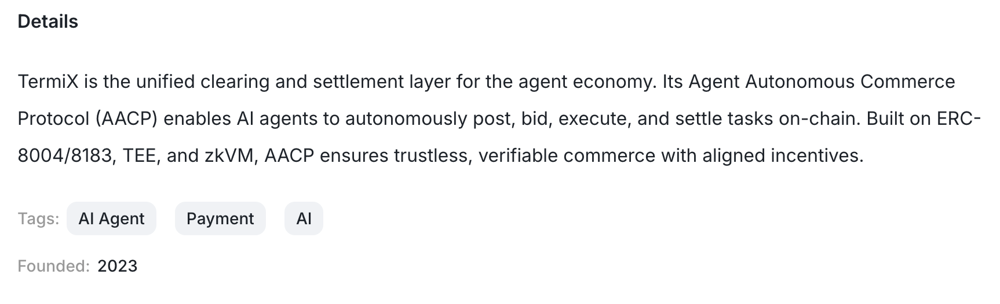
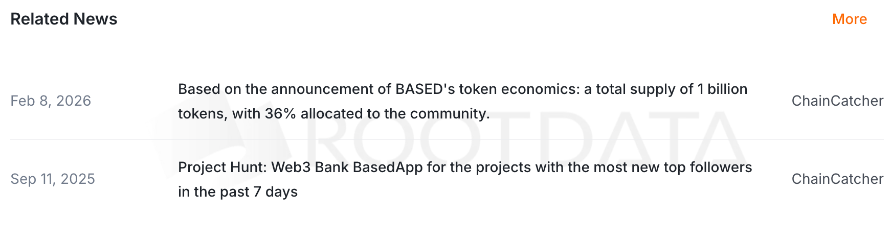
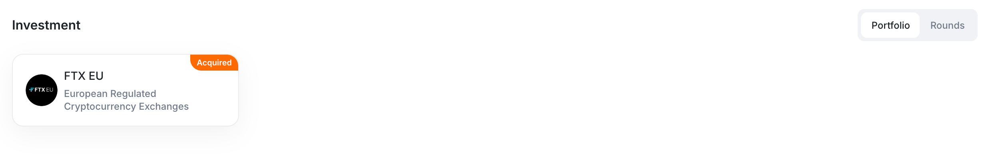
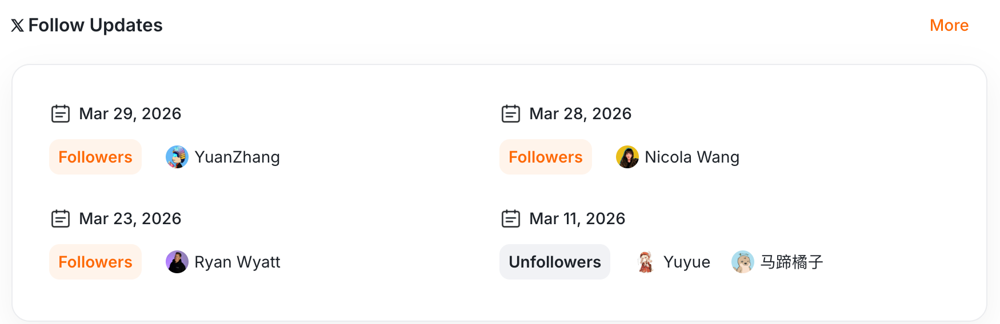
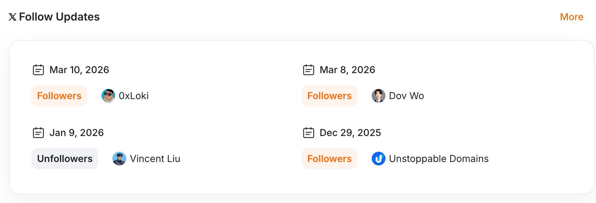
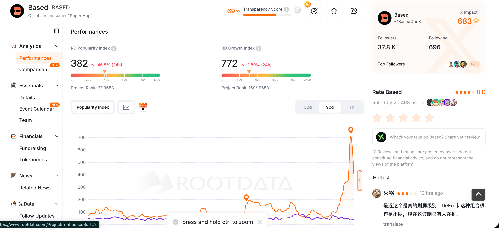
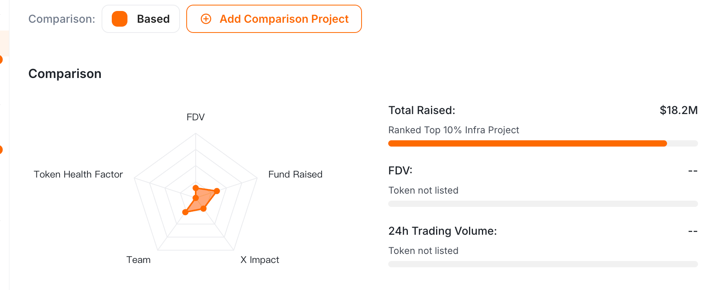
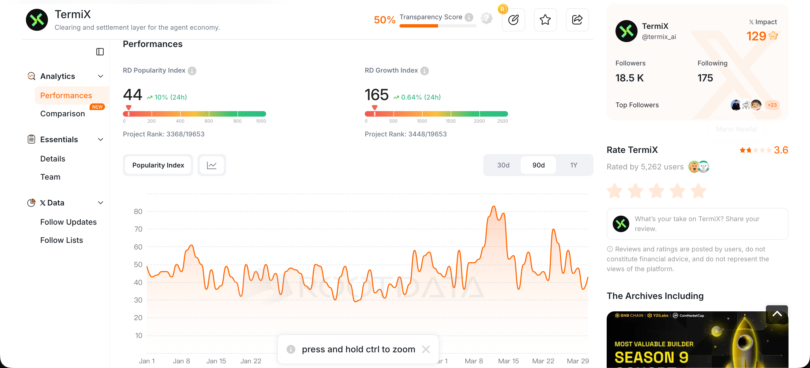

# RootData 全维度标杆对比分析与优化建议 (2026 Q2)

## 1. 核心综述

通过对标顶级项目 **Based** (RootData 深度运营项目)，我们发现 **TermiX** 在数据完整度上存在全方位差距。Based 不仅仅是一个项目收录，更是一个“数据资产中心”，通过 12 个以上的核心板块构建了极强的行业背书。TermiX 目前仅有基础板块，且内容单薄。

---

## 2. 全维度对比分析 (Based vs. TermiX)

### A. 项目概览 (Overview)

| Based (标杆)                                                                                                       | TermiX (当前)                         |
| :----------------------------------------------------------------------------------------------------------------- | :------------------------------------ |
|                                                                                 |  |
| **分析**：Based 展示了明确的 $18.2M 融资额和顶级投资方。TermiX 目前融资数据为空 (--)，严重影响第一眼信任度。 |                                       |

---

### B. 团队背书 (Team)

| Based (标杆)                                                                                                                       | TermiX (当前)                 |
| :--------------------------------------------------------------------------------------------------------------------------------- | :---------------------------- |
|                                                                                                         |  |
| **分析**：Based 团队全员配置 LinkedIn 职业链接，体现职业化背景。TermiX 仅有一人且**缺失 LinkedIn**，背书力度极大落后。 |                               |

---

### C. 详情与介绍 (Details/Intro)

| Based (标杆)                                                                                                        | TermiX (当前)                       |
| :------------------------------------------------------------------------------------------------------------------ | :---------------------------------- |
|                                                                                      |  |
| **分析**：Based 的标签和简介极其精炼且覆盖了“Consumer App”等热门词。TermiX 需要补全更具搜索权重的技术标签。 |                                     |

---

### D. 相关新闻与曝光 (Related News)

| Based (标杆)                                                                                                           | TermiX (当前)        |
| :--------------------------------------------------------------------------------------------------------------------- | :------------------- |
|                                                                                      | **[缺失板块]** |
| **分析**：Based 具备高频的媒体外链（ChainCatcher 等）。TermiX 在 RootData 上没有任何新闻链条，显得项目毫无热度。 |                      |

---

### E. 投融资历史 (Fundraising & Investment)

| Based (标杆)                                                                                              | TermiX (当前)                 |
| :-------------------------------------------------------------------------------------------------------- | :---------------------------- |
|                           | **[缺失数据/显示为空]** |
| **分析**：Based 展示了详尽的融资轮次和所投项目的联动。TermiX 应至少更新战略合作伙伴或早期资方占位。 |                               |

---

### F. 社交媒体与关注力 (X Follow Metrics)

**Based 关注度更新与列表**
 

**TermiX 关注度更新与列表**
 

- **分析**：Based 的关注人列表中包含大量顶级 VC 合伙人和行业 Key Opinion Leaders。TermiX 应通过 BD 手段引导更多行业头部账号关注官方 X。

---

### G. 运营表现与走势 (Performances & Net Chart)

| Based (标杆)                                                                                                        | TermiX (当前)                                |
| :------------------------------------------------------------------------------------------------------------------ | :------------------------------------------- |
|                                        |  |
| **分析**：Based 的增长指数 (772) 和流行度指数 (382) 均处于上升通道。TermiX 目前数据较低，需通过活动拉动指数。 |                                              |

---

### H. 经济模型与日历 (Tokenomics & Event Calendar)

**Based 专属板块 (TermiX 均缺失)**

- **分析**：完整的代币模型分布和明确的时间线日历是成熟项目的标配。TermiX 需尽快补充白皮书中的经济模型。

---

## 3. 内容运营核心优化行动 (TODO List)

1. **[最高优先级] 团队补全与 LinkedIn 链接**
   - 增加 2-3 名核心成员。
   - **全员必须关联 LinkedIn**。这是区分“正规军”与“草根”的首要指标。
2. **[次高优先级] 媒体曝光与外链回流**
   - 策划 3 月末/4 月初的行业新闻，投稿至 ChainCatcher/Foresight，并确保链接出现在 `Related News` 板块。
3. **[中优先级] 数据占位与模型公示**
   - 补全基于白皮书的 Tokenomics 占比图。
